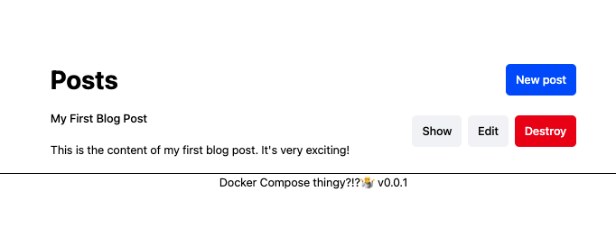

App:



## Run this app

```
# brings up the ambaradan
just up
# Initial setup - requires UP as it targets the Web
just db-create
just db-migrate
just db-seed
just assets-precompile
```

## Development Feedback Loop

This project is configured for a rapid feedback loop using Docker Compose. Here's how it works:

### Code Changes

The `web` service in the `docker-compose.yml` file mounts the application code from your local directory into the running container. This means any changes you make to your code are immediately reflected in the container. The Rails server is running in development mode, so it will automatically reload the code on each new web request. You do **not** need to rebuild the Docker image to see your changes.

### Database

The database data is stored in a Docker volume named `db_data`.

*   When you run `just up`, this volume is created if it doesn't exist.
*   When you run `just down`, which executes `docker compose down -v`, the `-v` flag **destroys** the `db_data` volume, and all your database data will be lost. This is useful for starting with a clean slate.

If you want to stop the containers without losing your data, you can run `docker compose down` (without the `-v`).
